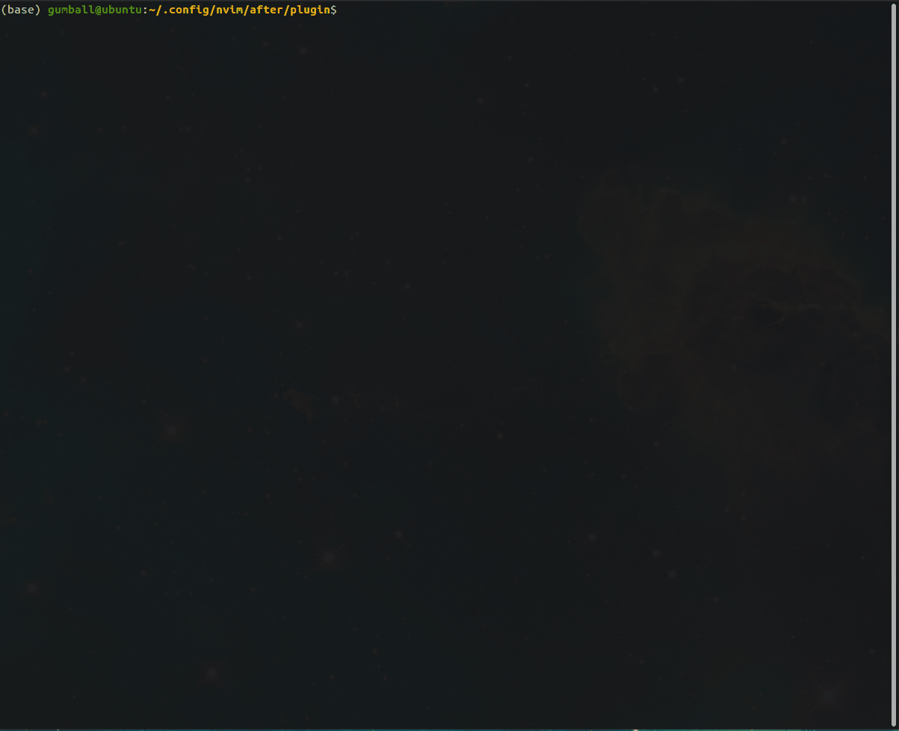
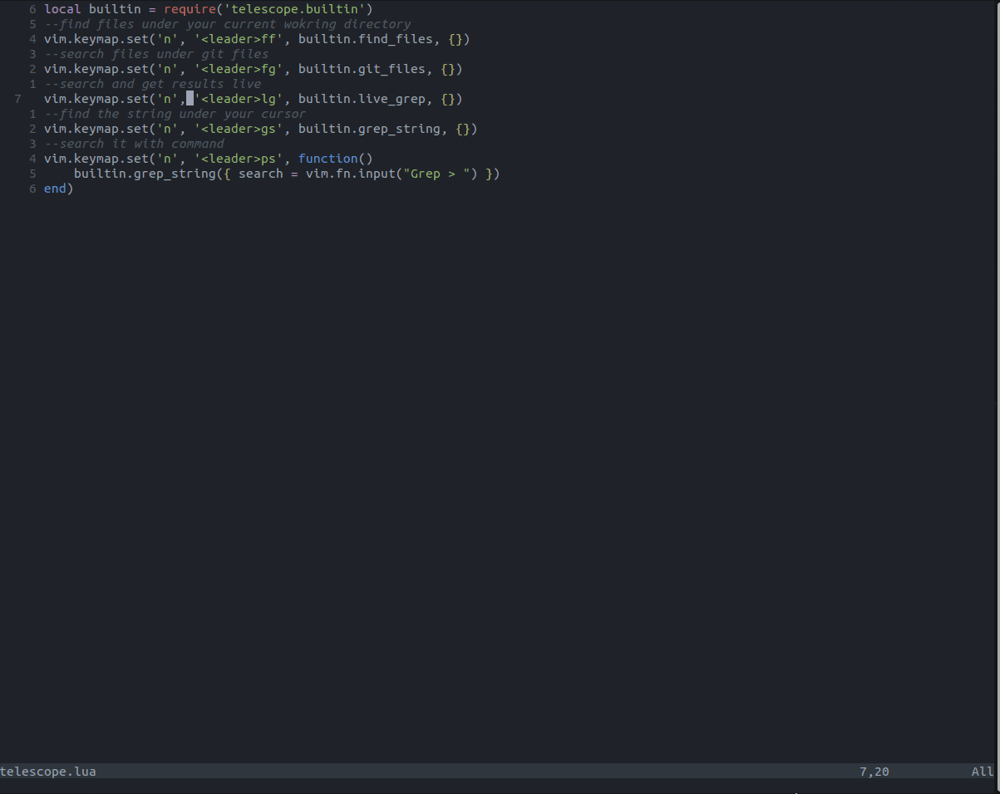
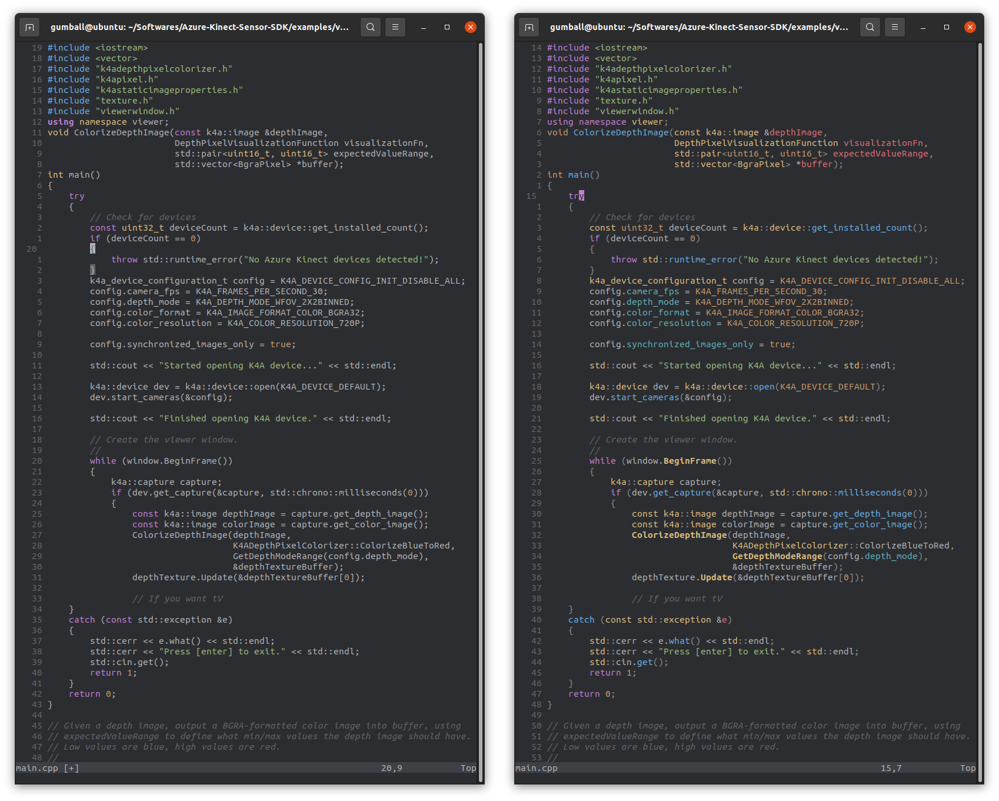
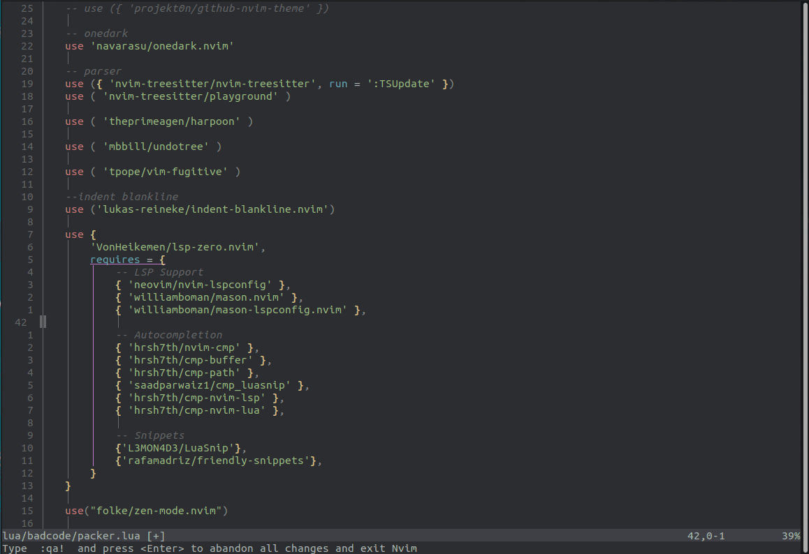
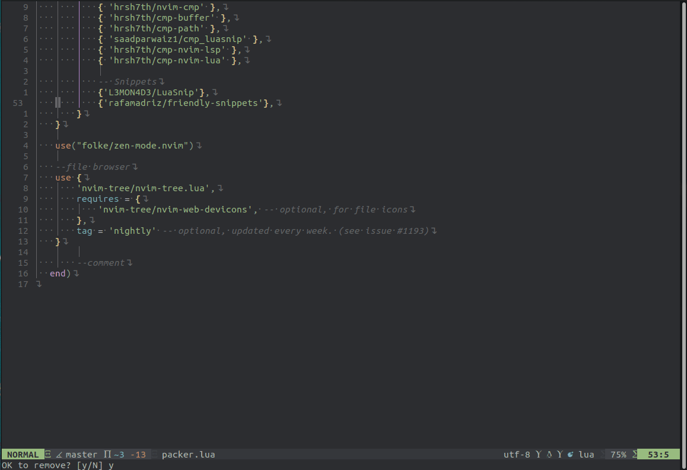
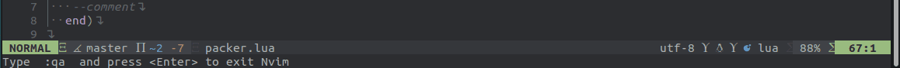
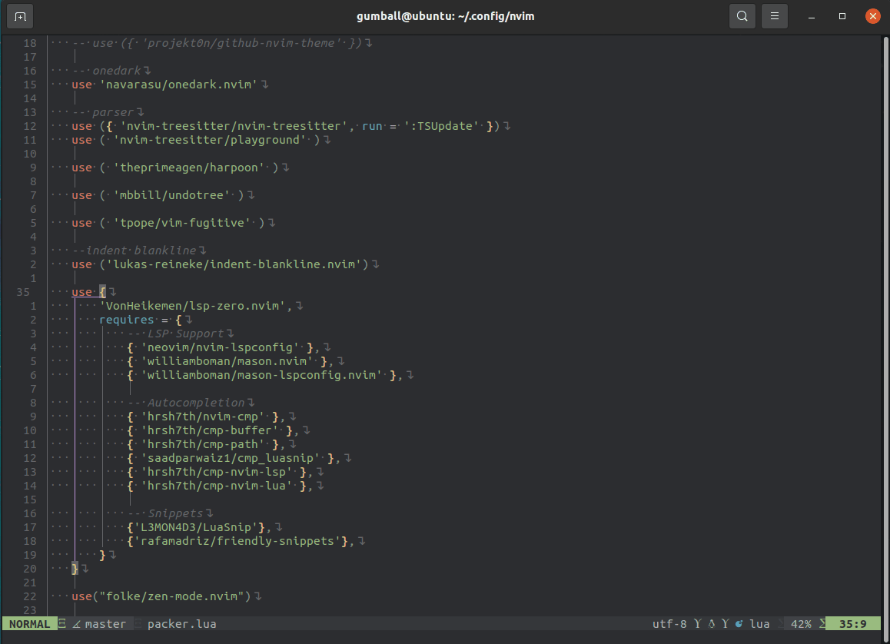

<div align="center">

<h1> fox-project </h1>


 

<br>

<br>


<h5> `Fox Project` is a config file for the all developers. It uses Lua API 
to be able to build the configuration. <h5>

<h6> Inspired by our ancient leader <a href="https://github.com/ThePrimeagen">ThePrimeagen</a> , you can find the original
configs <a href="https://github.com/ThePrimeagen/init.lua">here</a> </h6>


</div>

Contents
========
 * [Why?](#why-fox_face)
 * [Requirements](#requirements-wolf)
 * [Installation](#installation-cat2)
 * [Plugins](#plugins-bear)
 * [Configuration](#configuration-flamingo)
 * [Keymaps](#keymaps-chipmunk)
 * [Want to contribute?](#want-to-contribute-tiger)

## Why :fox_face:

Why not? I know, there are numerous options available, but i firmly believe that using Vim 
is more that just coding fast- it's a skill. There's a powerful feeling that comes with using Vim, 
effortlessly controlling vast or compact code bases within your terminal without any stuttering.
That's precisely why I decided to learn it some time ago. 
The next question is, Why Neovim?

- Community-supported codebase. While it may have some occasional bugs, this 
support means that new features are consistently being introduced, keeping it 
up to date and relevant. 
- Lua support as its scripting language, which provides enhanced flexibility and 
expressiveness for configuring and extending the editor. 
- Supporting asynchronous plugins.
- Native support for the Language Server Protocol (LSP) 

## Requirements :wolf:
`Neovim:`
```sh
add-apt-repository ppa:neovim-ppa/unstable
sudo apt-get update
sudo apt-get install neovim
```

> **Warning**
> If nvim its already installed, remove previous configs.

```sh
cd .config
rm -rf nvim
rm -rf ~/.local/share/nvim
rm -rf ~/.local/state/nvim
```

`Ripgrep:`
```sh
apt-get install ripgrep
```

`fd-find:`
```sh
sudo apt install fd-find
```

`Packer Package Management:`
```sh
git clone --depth 1 https://github.com/wbthomason/packer.nvim\
 ~/.local/share/nvim/site/pack/packer/start/packer.nvim
```

## Installation :cat2:

```sh
cd .config
mkdir nvim && cd nvim
git clone https://github.com/alitokur/neocpp.git .
```
Run following command and you will see millions of errors. But don't worry.

```sh
nvim lua/badcode/packer.lua
```


1-) Just skip these error lines with space or enter,

2-) then write `:so` and `:PackerSync` command.

3-) Some plugins will not install in the first time. Do it step 2 one more time.


## Plugins :bear:

| Application        | Description                                             | Plugin                     |
| ------------------ | ------------------------------------------------------- | -------------------------- |
| Theme              | Dark and Light Themes with TreeSitter syntax highlight. | [onedark.nvim](https://github.com/navarasu/onedark.nvim)           |
| Fuzzy Finder       | Extendable fuzzy finder over lists                      | [telescope.nvim](https://github.com/nvim-telescope/telescope.nvim) |
| Parser             | Language parsers                                        | [nvim-treesitter](https://github.com/nvim-treesitter/nvim-treesitter)|
| Auto-Completion    | Autocompletion - Language servers                       | [lsp-zero.nvim](https://github.com/VonHeikemen/lsp-zero.nvim)      |
| Undo History       | To visualize undo history                               | [mbbill/undotree](https://github.com/mbbill/undotree)              |
| Commenting         | Commenting plugin                                       | [comment.nvim](https://github.com/numToStr/Comment.nvim)           |
| Statusline         | Neovim statusline                                       | [lualine.nvim](https://github.com/nvim-lualine/lualine.nvim)       |
| File Explorer      | File Explorer For Neovim Written In Lua                 | [nvim-tree.lua](https://github.com/nvim-tree/nvim-tree.lua)        |
| Blankline          | Indentation guides to all lines                         | [indent-blankline.nvim](https://github.com/lukas-reineke/indent-blankline.nvim)      |

## Configuration :flamingo:
You can change this config file as you want. Use following structure to make modifications

1-) Add your plugins to lua/badcode/packer.lua

```lua
vim.cmd.packadd('packer.nvim')
return require('packer').startup(function(use)
    -- plugin manager
    use 'wbthomason/packer.nvim'

   --add your plugins here

end)
```

2-) Under the after/plugin, create a config.lua for each plugins that you add to packer lua

```sh
gumball@ubuntu:~/.config/nvim/after/plugin$ tree
.
├── plugin_name_1.lua
├── plugin_name_2.lua
└── plugin_name_3.lua
```


<details>
<summary>Theme</summary>

##

I use 'onedark' , but there are definitel more themes. Select what you want.

`packer.lua`

```lua
    -- onedark
    use 'navarasu/onedark.nvim'
```

`onedark.lua`

```lua
--theme options
require('onedark').setup {
    style = 'darker'
}
--enable theme
require('onedark').load()
```


</details>

<details>
<summary>Telescope</summary>

##

`packer.lua`

```lua
-- fuzzy finder
use {
    'nvim-telescope/telescope.nvim', tag = '0.1.0',
    -- or                            , branch = '0.1.x',
    requires = { {'nvim-lua/plenary.nvim'} }
}
```
`telescope.lua`
```lua
local builtin = require('telescope.builtin')
--find files under your current wokring directory
vim.keymap.set('n', '<leader>ff', builtin.find_files, {})
--search files under git files
vim.keymap.set('n', '<leader>fg', builtin.git_files, {})
--search and get results live
vim.keymap.set('n', '<leader>lg', builtin.live_grep, {})
--find the string under your cursor
vim.keymap.set('n', '<leader>gs', builtin.grep_string, {})
--search it with command
vim.keymap.set('n', '<leader>ps', function()
    builtin.grep_string({ search = vim.fn.input("Grep > ") })
end)
```


</details>


<details>
<summary>Treesitter</summary>

 ##

`packer.lua`
```lua
 -- parser
    use ({ 'nvim-treesitter/nvim-treesitter', run = ':TSUpdate' })
    use ( 'nvim-treesitter/playground' )
```
`treesitter.lua`
```lua
require'nvim-treesitter.configs'.setup {
  -- A list of parser names, or "all"
  ensure_installed = { "help", "c", "cpp", "cmake", "make", "javascript", "json", "vim", "comment", "markdown", "lua" },

  -- Install parsers synchronously (only applied to `ensure_installed`)
  sync_install = false,

  -- Automatically install missing parsers when entering buffer
  -- Recommendation: set to false if you don't have `tree-sitter` CLI installed locally
  auto_install = true,

  highlight = {
    -- `false` will disable the whole extension
    enable = true,

    -- Setting this to true will run `:h syntax` and tree-sitter at the same time.
    -- Set this to `true` if you depend on 'syntax' being enabled (like for indentation).
    -- Using this option may slow down your editor, and you may see some duplicate highlights.
    -- Instead of true it can also be a list of languages
    additional_vim_regex_highlighting = false,
  },
}

```



</details>


<details>
<summary>Harpoon</summary>

##

`packer.lua`

```lua
use ( 'theprimeagen/harpoon' )
```

`harpoon.lua`

```lua
local mark = require("harpoon.mark")
local ui = require("harpoon.ui")

vim.keymap.set("n", "<leader>a", mark.add_file)
vim.keymap.set("n", "<C-e>", ui.toggle_quick_menu)

vim.keymap.set("n", "<leader>1", function() ui.nav_file(1) end)
vim.keymap.set("n", "<leader>2", function() ui.nav_file(2) end)
vim.keymap.set("n", "<leader>3", function() ui.nav_file(3) end)
vim.keymap.set("n", "<leader>4", function() ui.nav_file(4) end)
```


</details>

<details>
<summary>Undotree</summary>

##


`packer.lua`

```lua
use ( 'mbbill/undotree' )
```

`undotree.lua`

```lua
vim.keymap.set("n", "<leader>u", vim.cmd.UndotreeToggle)



```
</details>


<details>
<summary>Indent</summary>

##

`packer.lua`

```lua
    --indent blankline
    use ('lukas-reineke/indent-blankline.nvim')
```

`indent.lua`

```lua

    vim.opt.list = true
vim.opt.listchars:append "space:⋅"
vim.opt.listchars:append "eol:↴"

require("indent_blankline").setup {
    space_char_blankline = " ",
    show_current_context = true,
    show_current_context_start = true,
}
```


</details>

<details>
<summary>LSP</summary>

##

`packer.lua`

```lua
 use {
        'VonHeikemen/lsp-zero.nvim',
        requires = {
            -- LSP Support
            { 'neovim/nvim-lspconfig' },
            { 'williamboman/mason.nvim' },
            { 'williamboman/mason-lspconfig.nvim' },

            -- Autocompletion
            { 'hrsh7th/nvim-cmp' },
            { 'hrsh7th/cmp-buffer' },
            { 'hrsh7th/cmp-path' },
            { 'saadparwaiz1/cmp_luasnip' },
            { 'hrsh7th/cmp-nvim-lsp' },
            { 'hrsh7th/cmp-nvim-lua' },

            -- Snippets
            {'L3MON4D3/LuaSnip'},
            {'rafamadriz/friendly-snippets'},
        }
    }
```
`lsp.lua`
```lua

local lsp = require("lsp-zero")

lsp.preset("recommended")

lsp.ensure_installed({
  'eslint',
  'sumneko_lua',
  'clangd',
})

-- Fix Undefined global 'vim'
lsp.configure('sumneko_lua', {
    settings = {
        Lua = {
            diagnostics = {
                globals = { 'vim' }
            }
        }
    }
})

local cmp = require('cmp')
local cmp_select = {behavior = cmp.SelectBehavior.Select}
local cmp_mappings = lsp.defaults.cmp_mappings({
  ['<C-p>'] = cmp.mapping.select_prev_item(cmp_select),
  ['<C-n>'] = cmp.mapping.select_next_item(cmp_select),
  ['<C-y>'] = cmp.mapping.confirm({ select = true }),
  ["<C-Space>"] = cmp.mapping.complete(),
})

-- disable completion with tab
-- this helps with copilot setup
--cmp_mappings['<Tab>'] = nil
--cmp_mappings['<S-Tab>'] = nil

lsp.setup_nvim_cmp({
  mapping = cmp_mappings
})

lsp.set_preferences({
    suggest_lsp_servers = false,
    cmp_capabilities = true,

    sign_icons = {
    error = '✘',
    warn = '▲',
    hint = '⚑',
    info = ''
}
})

lsp.on_attach(function(client, bufnr)
  local opts = {buffer = bufnr, remap = false}

  if client.name == "eslint" then
      vim.cmd.LspStop('eslint')
      return
  end

  vim.keymap.set("n", "gd", vim.lsp.buf.definition, opts)
  vim.keymap.set("n", "K", vim.lsp.buf.hover, opts)
  vim.keymap.set("n", "<leader>vws", vim.lsp.buf.workspace_symbol, opts)
  vim.keymap.set("n", "<leader>vd", vim.diagnostic.open_float, opts)
  vim.keymap.set("n", "[d", vim.diagnostic.goto_next, opts)
  vim.keymap.set("n", "]d", vim.diagnostic.goto_prev, opts)
  vim.keymap.set("n", "<leader>vca", vim.lsp.buf.code_action, opts)
  vim.keymap.set("n", "<leader>vrr", vim.lsp.buf.references, opts)
  vim.keymap.set("n", "<leader>vrn", vim.lsp.buf.rename, opts)
  vim.keymap.set("i", "<C-h>", vim.lsp.buf.signature_help, opts)
end)

lsp.setup()

vim.diagnostic.config({
    virtual_text = true,
})
```

</details>

<details>
<summary>File Browser</summary>

##


`packer.lua`

```lua
 --file browser
    use {
        'nvim-tree/nvim-tree.lua',
        requires = {
            'nvim-tree/nvim-web-devicons', -- optional, for file icons
        },
        tag = 'nightly' -- optional, updated every week. (see issue #1193)
    }
```

`tree.lua`

```lua
    -- examples for your init.lua disable netrw at the very start of your init.lua (strongly advised)
vim.g.loaded_netrw = 1
vim.g.loaded_netrwPlugin = 1

-- set termguicolors to enable highlight groups
vim.opt.termguicolors = true

-- empty setup using defaults
require("nvim-tree").setup()
vim.keymap.set("n", "<leader>pv", vim.cmd.NvimTreeToggle)


local HEIGHT_RATIO = 0.8  -- You can change this
local WIDTH_RATIO = 0.5   -- You can change this too

require('nvim-tree').setup({
  view = {
    float = {
      enable = true,
      open_win_config = function()
        local screen_w = vim.opt.columns:get()
        local screen_h = vim.opt.lines:get() - vim.opt.cmdheight:get()
        local window_w = screen_w * WIDTH_RATIO
        local window_h = screen_h * HEIGHT_RATIO
        local window_w_int = math.floor(window_w)
        local window_h_int = math.floor(window_h)
        local center_x = (screen_w - window_w) / 2
        local center_y = ((vim.opt.lines:get() - window_h) / 2)
                         - vim.opt.cmdheight:get()
        return {
          border = 'rounded',
          relative = 'editor',
          row = center_y,
          col = center_x,
          width = window_w_int,
          height = window_h_int,
        }
        end,
    },
    width = function()
      return math.floor(vim.opt.columns:get() * WIDTH_RATIO)
    end,
  },
})
```


</details>


<details>
<summary>Airline</summary>

##


`packer.lua`

```lua
  --airline
    use {
        'nvim-lualine/lualine.nvim',
        requires = { 'kyazdani42/nvim-web-devicons', opt = true }
    }
```


`airline.lua`

```lua
    require('lualine').setup {
  options = {
    icons_enabled = true,
    theme = 'auto',
    --component_separators = { left = '', right = ''},
    --section_separators = { left = '', right = ''},
    disabled_filetypes = {
      statusline = {},
      winbar = {},
    },
    ignore_focus = {},
    always_divide_middle = true,
    globalstatus = false,
    refresh = {
      statusline = 1000,
      tabline = 1000,
      winbar = 1000,
    }
  },
  sections = {
    lualine_a = {'mode'},
    lualine_b = {'branch', 'diff', 'diagnostics'},
    lualine_c = {'filename'},
    lualine_x = {'encoding', 'fileformat', 'filetype'},
    lualine_y = {'progress'},
    lualine_z = {'location'}
  },
  inactive_sections = {
    lualine_a = {},
    lualine_b = {},
    lualine_c = {'filename'},
    lualine_x = {'location'},
    lualine_y = {},
    lualine_z = {}
  },
  tabline = {},
  winbar = {},
  inactive_winbar = {},
  extensions = {}
}

```



</details>

<details>
<summary>Comment</summary>

##

`packer.lua`

```lua
    --comment
    use {
        'numToStr/Comment.nvim',
        config = function()
            require('Comment').setup()
        end
    }
```

`comment.lua`

```lua
require('Comment').setup()
```



</details>

## Keymaps :chipmunk:

| Command                            | Keymap                                 | Description                         |
| ---------------------------------  | -------------------------------------- | ------------------------------------|
| splits                             | Alt + h                                | Create horizantal split             |
| splits                             | Alt + h                                | Create vertical split               |
| splits                             | Ctrl + h                               | Move left                           |
| splits                             | Ctrl + j                               | Move right                          |
| splits                             | Ctrl + k                               | Move up                             |
| splits                             | Ctrl + l                               | Move down                           |
| splits                             | Ctrl + h                               | Move left                           |
| splits                             | Alt + d                                | Vertical resize +3                  |
| splits                             | Alt + a                                | Vertical resize -3                  |
| splits                             | Alt + w                                | Horizantal resize +3                |
| splits                             | Alt + s                                | Horizaton resize  -3                |
| splits                             | Space + th                             | Make vertical split to horizantal   |
| splits                             | Space + tk                             | Make horizantal split to vertical   |
| movement                           | J                                      | Move selected blocks to up          |
| movement                           | K                                      | Move selected blocks to down        |
| movement                           | Ctrl + d                               | Half page jumping down              |
| movement                           | Ctrl + u                               | Half page jumping up                |
| copy-paste                         | Space + p                              | Paste but keep buffer               |
| comment - (normal)                 | gcc                                    | linewise comment toggle             |
| comment - (normal)                 | gbc                                    | blockwise comment toggle            | 
| comment - (visual)                 | gc                                     | Linewise comment toggle             |
| comment - (visual)                 | gb                                     | Blockwise comment toggle            |
| telescope - (normal)               | Space + ff                             | Find files                          |
| telescope - (normal)               | Space + fg                             | Find in git files                   |
| telescope - (normal)               | Space + lg                             | Live grep                           |
| telescope - (normal)               | Space + gs                             | Grep string                         |
| telescope - (normal)               | Space + ps                             | Grep with command                   |
| harpoon - (normal)                 | Space + a                              | Add to harpoon list                 |
| harpoon - (normal)                 | Ctrl +  e                              | Open harpoon list                   |
| harpoon - (normal)                 | Space + 1  (or 2,3,4)                  | Jump the seletected buffer          |
| nvim-tree - (normal)               | Space + pv                             | Toggle nvim-tree                    |
| undotree - (normal)                | Space + u                              | Toggle undotree                     |
| treesitter - (normal)              | grr                                    | Smart rename                        |
| lsp-zero   - (normal)              | gd                                     | Find definition                     |
| lsp-zero   - (normal)              | K                                      | Display information                 |
| lsp-zero   - (normal)              | Space + vws                            | xxxxxxxxxxxxx                       |
| lsp-zero   - (normal)              | Space + vd                             | xxxxxxxxxxxxx                       |
| lsp-zero   - (normal)              | [d                                     | xxxxxxxxxxxxx                       |
| lsp-zero   - (normal)              | ]d                                     | xxxxxxxxxxxxx                       |
| lsp-zero   - (normal)              | Space + vca                            | xxxxxxxxxxxxx                       |
| lsp-zero   - (normal)              | Space + vrr                            | xxxxxxxxxxxxx                       |
| lsp-zero   - (normal)              | Space + vrn                            | xxxxxxxxxxxxx                       |
| nvim-tree  - (map)                 | Ctrl + v                               | Vertical split                      |
| lsp-zero   - (map)                 | Ctrl + x                               | Horizantal split                    |

## Want to contribute? :tiger:
If you have some good tricks, configs, and plugins,  all contributions are welcome.
